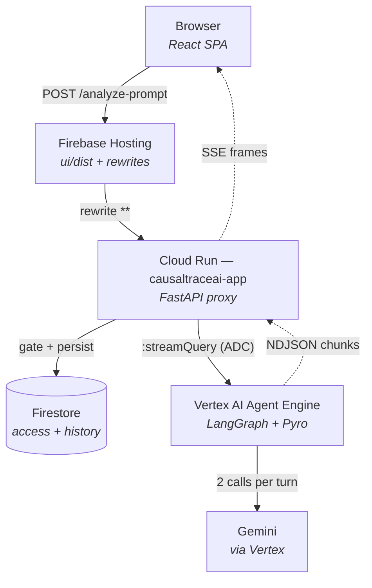
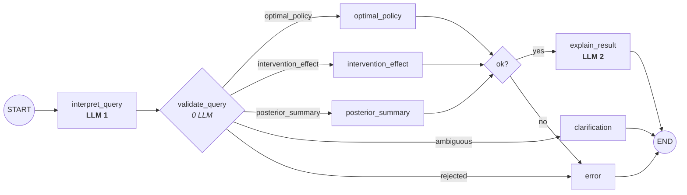

# CausalTraceAI — Architecture and Deployment

How the system is put together, then how to stand up a new copy of it.

Read Part 1 before running anything. Most deployment mistakes here are not
mistakes about `gcloud` — they are mistakes about which of the two deployment
units a change belongs to, and they produce a stack that looks healthy and
answers with fabricated numbers.

---

# Part 1 — Architecture

## 1.1 The one-sentence version

A browser talks to a **FastAPI proxy on Cloud Run**, which streams a question to
a **LangGraph agent on Vertex AI Agent Engine**, which calls **Gemini twice** —
once to read the question, once to narrate the answer — and does every number in
between with **Pyro Monte Carlo sampling**.

> **The LLM never does math.** It translates language *in* and narrates results
> *out*. Every number in an answer comes from the Pyro engine.

That constraint is the reason for most of the structure below. If the model
could do arithmetic, one service would do.

## 1.2 The four tiers



| Tier | What it is | Deployed by | Source |
|---|---|---|---|
| Hosting | Static bundle + a rewrite sending every non-static path to Cloud Run | `firebase deploy` | `ui/` |
| Proxy | FastAPI: access gate, quota, history, SSE fan-out | `gcloud run deploy` | `proxy/`, `Dockerfile.proxy` |
| Agent | LangGraph state machine, pickled into a managed runtime | `deploy_agent.py` | `src/` |
| Data | Firestore (named database), Agent Engine sessions | Terraform / console | `terraform/` |

## 1.3 Why the agent and the proxy are separate deployments

This is the single most important thing to understand before deploying, because
almost every "why didn't my change take effect" question resolves to it.

**They ship different code, from different manifests, by different tools.**

|  | Agent | Proxy |
|---|---|---|
| Code | `src/` | `proxy/` + built `ui/dist` |
| Manifest | `requirements.txt` | `requirements-proxy.txt` |
| Carries | langgraph, **torch, pyro** (~1 GB) | fastapi, httpx, firebase-admin |
| Built by | Vertex SDK, managed environment | `Dockerfile.proxy`, your Docker |
| Deployed by | `deploy_agent.py` | `gcloud run deploy` |
| Cold start | minutes | seconds |

`Dockerfile.proxy` deliberately **never copies `src/`**. The causal stack is
dead weight on a latency-sensitive service, so it lives only in the Agent
Engine. The consequences in practice:

- Edited `src/causal/decision.py`? Redeploy the **agent**. Redeploying the proxy
  changes nothing.
- Edited `proxy/main.py` or anything under `ui/`? Redeploy the **proxy**. The
  agent is untouched.
- Added an import to `proxy/*.py`? It must appear in `requirements-proxy.txt` or
  the container fails at *start*, not in CI.

## 1.4 Inside the agent: the LangGraph pipeline



Node names are exactly as registered in
[`src/causal/graph_app.py:420-457`](../src/causal/graph_app.py#L420-L457).

**Two Gemini calls per answered question, zero for the math.** The three compute
nodes are pure Pyro. `clarification` and `error` terminate without the second
call, so an ambiguous or rejected question costs one.

**`validate_query` is the guarantee, not the prompt.** The prompt *asks* Gemini
to use only known cause names; `validate_query` re-checks every LLM-supplied
name against the live engine before any sampling happens. A prompt is a request;
this is enforcement.

**No checkpointer.** Each turn is self-contained and the proxy owns conversation
history. Adding one would make the same question answered twice depend on which
session it arrived in.

## 1.5 The agent↔proxy seam

Three details here are load-bearing, and each has a failure mode that looks like
something else.

**1. The endpoint must end in `:query`.** The proxy derives the streaming URL by
substitution — [`proxy/main.py:895`](../proxy/main.py#L895):

```python
stream_url = agent_engine_base.replace(":query", ":streamQuery")
```

[`proxy/admin.py:406`](../proxy/admin.py#L406) splits on the same suffix to build
the session-delete URL for the retention sweep. An endpoint without it POSTs to
the wrong method and breaks 24-hour retention.

**2. `stream_mode` must be `"updates"`.** The request body is:

```json
{"class_method": "stream_query",
 "input": {"input": {"user_input": "..."}, "stream_mode": "updates"}}
```

The doubled `input` is not a typo — `LanggraphAgent` forwards its `input` key
straight into the compiled graph. Under LangGraph 1.x the default mode is
`"values"`, which re-sends the entire state on every step; the proxy's
trace-line high-water mark would then resend every line each frame.

**3. Reduced channels must be reduced *again* on the proxy side.**
`stream_mode="updates"` yields what a node **returned**, not the merged channel.
`causal_steps` (`operator.add`) and `causal_usage` (`add_usage`) therefore need a
second reduction in the proxy. Getting this wrong loses every trace line except
the last node's, and bills each turn at the explainer's token usage alone —
roughly half the real cost, which lets the quota gate pass turns it should have
stopped. [`tests/test_proxy_adapter.py`](../tests/test_proxy_adapter.py) pins it.

Everything the pipeline produces is prefixed `causal_`; that prefix *is* the
transport contract. See [`src/causal/state.py`](../src/causal/state.py).

## 1.6 State, and what is not idempotent

**`learn()` accumulates.** Conjugate updates fold into the hyperparameters, so
calling it per request would sharpen the posteriors as traffic arrived, with
nothing in the output to explain why yesterday's answer differs from today's.
`get_causal_api()` is process-cached so the ten training observations are folded
in exactly once per serving process.

**`CAUSAL_SEED` changes every reported number.** Default 123, with 20,000 Monte
Carlo worlds — the notebook's §4.7 settings, which the parity tests pin exactly.
Treat both as part of the product, not as tuning knobs.

Where state lives:

| State | Home | Lifetime |
|---|---|---|
| Access records, quota | Firestore (named DB) | until deleted |
| Conversation history | Firestore | `CHAT_RETENTION_HOURS` (24) |
| Run metrics | Firestore | `RUN_METRICS_RETENTION_DAYS` (30) |
| Agent session | Agent Engine, server-side | swept with the chat |
| Posterior updates | Serving process memory | until cold start |

## 1.7 Authentication, in both directions

**Inbound** — magic-link email, HMAC-signed session, admin approval gate.
`require_access(user)` runs before anything costs money. See
[access_control.md](access_control.md).

**Outbound** — the proxy calls Agent Engine with Application Default
Credentials, resolved **once** and cached with a 300s refresh skew
([`proxy/main.py:951`](../proxy/main.py#L951)). This matters: `google.auth.default()`
and `.refresh()` are both blocking, and inside `async def` on a container serving
up to 80 concurrent requests, doing it per-request froze the event loop — every
in-flight SSE stream included — to re-mint a token valid for an hour.

The Cloud Run runtime service account therefore needs `roles/aiplatform.user`
(call the engine) and `roles/datastore.user` (Firestore, on every request).

---

# Part 2 — Deployment

## 2.1 Which script to use

| You want | Script |
|---|---|
| Update the existing stack in place | `./deploy_to_gcp.sh` |
| A **new engine + new proxy**, side by side | `./deploy_new_stack.sh --stack <name>` |
| Just show what would be sent | `python deploy_agent.py --dry-run` |

`deploy_to_gcp.sh` reuses the engine in `deployment_metadata.json` and redeploys
the one production service. It has no way to force a new engine.

`deploy_new_stack.sh` creates a genuinely independent stack: new
`reasoningEngine`, new Cloud Run service `causaltraceai-app-<stack>`, its own
Firestore database, its own metadata file. **Hosting is not touched** unless you
pass `--promote-hosting`. Nothing it does can modify production.

On Windows, run these from **Git Bash**, not PowerShell.

## 2.2 Step 0 — find out what is actually live

Do this first. This repo was renamed TracerLensAi → CausalTraceAI, and the names
did not all move together.

```bash
gcloud run services list --project "$GOOGLE_CLOUD_PROJECT"
gcloud firestore databases list --project "$GOOGLE_CLOUD_PROJECT"

# Agent Engines. `gcloud ai reasoning-engines` needs the beta component
# (`gcloud components install beta`); the REST API works with the core CLI:
curl -s -H "Authorization: Bearer $(gcloud auth print-access-token)" \
  "https://europe-west2-aiplatform.googleapis.com/v1/projects/$GOOGLE_CLOUD_PROJECT/locations/europe-west2/reasoningEngines" \
  | python -c "import json,sys;[print(e['name'], e.get('displayName')) for e in json.load(sys.stdin).get('reasoningEngines',[])]"
```

### What this returned on `icarus-agent-26` (checked 2026-08-10)

| | Found |
|---|---|
| Cloud Run | `tracerlensai-app` (production), `tracerlensai-app-dev`, `tracerlens-api` |
| Cloud Run | **`causaltraceai-app` does not exist** |
| Firestore | `tracerlensai`, `tracerlensai-dev`, `tracerlensai-staging` |
| Agent Engine | one only — `.../reasoningEngines/382955501907869696`, displayName `TracerLensAi` |

Three consequences worth absorbing before you run anything:

1. **`deploy_to_gcp.sh` has never been run against this project.** It deploys a
   service named `causaltraceai-app`, and no such service exists. Its first run
   will *create* a second service alongside `tracerlensai-app`, not update it.
2. **The one existing engine is the old ADK-era agent**, not this LangGraph one
   (its spec carries `AGENT_VERSION=0.1.0` and `GOOGLE_GENAI_USE_VERTEXAI`).
   The CausalTraceAI agent in `src/` has never been deployed. Whatever you do
   next is a genuine first deployment of it.
3. **`firebase.json` now names `causaltraceai-app`**, corrected as part of this
   change to match `deploy_to_gcp.sh`. That service does not exist yet, so
   `./deploy_to_gcp.sh --only hosting` on its own would publish a rewrite
   pointing at nothing and 404 every non-static path. A guard in the hosting
   stage now checks the service exists and refuses rather than doing it. Deploy
   the proxy first, or run the full `./deploy_to_gcp.sh`, which orders
   proxy-before-hosting for exactly this reason.

Confirm what the live domain currently resolves to before changing anything:

```bash
curl -s -o /dev/null -w '%{http_code}\n' https://causaltraceai.com/health
```

Note any orphaned engines from earlier `--create` runs. An idle Agent Engine
still bills.

## 2.3 Prerequisites

**Tools:** `gcloud` (authenticated), `docker`, `python`, `curl`, `node`/`npm`,
and `firebase` CLI only if you will publish Hosting.

**Two separate credentials.** Both are required and one does not imply the other:

```bash
gcloud auth login                      # for the gcloud CLI
gcloud auth application-default login  # for the Vertex SDK — ADC
```

**APIs:**

```bash
gcloud services enable \
  aiplatform.googleapis.com run.googleapis.com artifactregistry.googleapis.com \
  firestore.googleapis.com storage.googleapis.com iamcredentials.googleapis.com \
  --project "$GOOGLE_CLOUD_PROJECT"
```

**Runtime service account and its roles.** `gcloud run deploy` only preserves a
service account on a *redeploy*; the first deploy of any new service name falls
back to the default Compute Engine SA, which has none of these grants:

```bash
SA="agent-app-sa@${GOOGLE_CLOUD_PROJECT}.iam.gserviceaccount.com"
for ROLE in roles/aiplatform.user roles/datastore.user roles/logging.logWriter; do
  gcloud projects add-iam-policy-binding "$GOOGLE_CLOUD_PROJECT" \
    --member="serviceAccount:$SA" --role="$ROLE"
done
```

`roles/datastore.user` is the one that gets forgotten. Without it the service
starts perfectly and 403s the first time anyone signs in.

**Staging bucket** (the SDK uploads the pickled agent here):

```bash
gcloud storage buckets create gs://<your-bucket> --location=europe-west2
```

**Firestore database.** The proxy opens a *named* database and never creates
one:

```bash
gcloud firestore databases create --database=causaltraceai-v2 \
  --location=europe-west2 --type=firestore-native
```

> The default in [`proxy/access.py:204`](../proxy/access.py#L204) is
> `"tracerlensai"` — the pre-rename name, which is what the live database is
> actually called. Do not "fix" that default without migrating the data. Set
> `FIRESTORE_DATABASE_ID` explicitly instead.

**Install the CPU torch wheel** before running `deploy_agent.py`:

```bash
pip install --index-url https://download.pytorch.org/whl/cpu torch
```

The default index resolves CUDA builds and adds roughly a gigabyte for GPU
support nothing here uses.

## 2.4 Configuration

```bash
export GOOGLE_CLOUD_PROJECT=icarus-agent-26
export GOOGLE_CLOUD_REGION=europe-west2
export AGENT_ENGINE_STAGING_BUCKET=gs://<your-bucket>
export ACCESS_SIGNING_SECRET=$(python -c 'import secrets;print(secrets.token_urlsafe(32))')
export ADMIN_TOKEN=$(python -c 'import secrets;print(secrets.token_urlsafe(24))')
export APP_URL=https://<the-new-stack-origin>
export RESEND_API_KEY=...        # or the SMTP_* set
```

Three of these have failure modes worth naming:

| Variable | If unset |
|---|---|
| `ACCESS_SIGNING_SECRET` | Ephemeral per-process key — **every cold start signs all users out** |
| `ADMIN_TOKEN` | `/admin` returns 503, so nobody can approve the first user — on a new stack, nobody can use it at all |
| `APP_URL` | The revision **refuses to start** on Cloud Run, rather than mail sign-in links pointing at `localhost:8080` |

`APP_URL` is a chicken-and-egg on a stack with no domain: you need the Cloud Run
URL, which does not exist until the first deploy. Either predict it, or deploy
once with `--skip-proxy`, read the URL, and set it.

## 2.5 The deployment

**Always dry-run first.** Preflight runs for real (read-only) and every mutation
prints as `[dry-run]`:

```bash
./deploy_new_stack.sh --stack v2 --dry-run
```

Then:

```bash
./deploy_new_stack.sh --stack v2 --app-url https://v2.causaltraceai.com
```

Six phases, and what each is really doing:

| # | Phase | Time | Notes |
|---|---|---|---|
| 1 | Preflight | seconds | All checks run; failures report **together**. Nothing is created. |
| 2 | Agent Engine | **5–15 min** | Pickles the agent, uploads `src/`, builds the managed env from `requirements.txt`. Torch and pyro make this slow. |
| 3 | Resolve + probe | 1–3 min | Builds the `:query` URL, then calls `:streamQuery` for real to prove the engine answers. Costs 2 Gemini calls. |
| 4 | Build + push | 2–5 min | Three-stage `Dockerfile.proxy`: pip deps, npm build, slim runtime. |
| 5 | Cloud Run deploy | 1–2 min | `--set-env-vars` (not `--update-`), explicit SA, `--timeout 900`. |
| 6 | Verify | seconds | `/health`, then reads the endpoint back off the live revision. |

**Why preflight accumulates failures instead of stopping at the first.** A
half-built stack is the expensive outcome: the engine is created and billing, the
proxy failed on a missing role, and your next run creates a *second* engine.

**Why phase 2 protects `deployment_metadata.json`.** `deploy_agent.py` always
writes that file, and with `--create` it would replace production's recorded
engine id — after which every later `deploy_to_gcp.sh --only agent` would update
your new engine while reporting that it updated production. The script backs the
file up, moves the result to `deployment_metadata.<stack>.json`, and restores the
original through an `EXIT` trap.

**Why `--timeout 900`.** Causal runs stream for minutes. Cloud Run's 300s default
truncates them mid-answer.

## 2.6 Verifying — and how to spot mock mode

`/health` returns 200 whether or not the proxy has an engine. It cannot tell you
the stack is real. Check three things:

```bash
# 1. Health
curl -s -o /dev/null -w '%{http_code}\n' "$SERVICE_URL/health"

# 2. The live revision actually carries an engine endpoint
gcloud run services describe causaltraceai-app-v2 --region europe-west2 \
  --format='value(spec.template.spec.containers[0].env)' | grep -o 'reasoningEngines/[0-9]*'
```

3. **Ask two different questions in the UI.** With no `AGENT_ENGINE_ENDPOINT`,
   `proxy/main.py` serves a scripted run from `proxy/mockdata.py` — real engine
   output, pasted. It looks completely convincing.

> **The tell: identical numbers across different questions.** Ask with demand 13,
> then with demand 30. If the recommended policy and expected utility do not
> move, you are in mock mode.

Then sign in: open `$SERVICE_URL/admin`, authenticate with `ADMIN_TOKEN`, and
approve your own address — a new stack has an empty access database, so until you
do, every request is gated.

Logs:

```bash
gcloud run services logs read causaltraceai-app-v2 --region europe-west2 --limit 100
```

Each turn prints `run_id=... trace_id=... chat_id=...`, so a run in the UI can be
found in Cloud Logging and followed into Cloud Trace.

## 2.7 Cutover

Only after the new stack answers real questions correctly.

```bash
./deploy_new_stack.sh --stack v2 --promote-hosting --skip-agent --skip-proxy
```

This rewrites `firebase.json`'s `serviceId`, rebuilds `ui/`, and publishes
Hosting. The prompt before it is deliberate — this is the step that moves live
traffic.

Two things to know:

**The UI's API base.** [`ui/index.html:38`](../ui/index.html#L38) sends calls
cross-origin only for hosts in `PRODUCTION_HOSTING_DOMAINS`; everything else is
same-origin. A new stack on its own Cloud Run URL is same-origin and needs no
`CORS_ORIGINS` — which is why the script leaves it empty by default. If you point
a custom domain at the new service, add it to both.

**⚠ Terraform.** `terraform/cloudrun.tf` had the stale name too, and it is now
corrected — but `name` is not an updatable attribute. Applying it **destroys and
recreates** the service. Run `terraform plan` and read it; do not apply during
normal operation. That block is only a bootstrap stub (hello-world image,
`ignore_changes` on it) while both deploy scripts manage the real service through
`gcloud run deploy`. Deleting the resource from Terraform is the cleaner end
state.

## 2.8 Rollback

| Layer | Command |
|---|---|
| Hosting | `git checkout firebase.json && firebase deploy --only hosting` |
| Proxy revision | `gcloud run services update-traffic causaltraceai-app-v2 --to-revisions=<prev>=100 --region europe-west2` |
| Proxy service | `gcloud run services delete causaltraceai-app-v2 --region europe-west2` |
| Agent | Point `AGENT_ENGINE_ENDPOINT` back at the old engine and redeploy the proxy |
| Engine | `curl -sX DELETE -H "Authorization: Bearer $(gcloud auth print-access-token)" "$BASE/$LOC/reasoningEngines/<id>?force=true"` (see §2.10) |

Because the new stack is side-by-side, rollback is usually just repointing
Hosting. The old engine and service were never modified.

## 2.9 Troubleshooting

Keyed by the symptom you actually observe.

| Symptom | Cause |
|---|---|
| **Answers look right but never change** | Mock mode. `AGENT_ENGINE_ENDPOINT` is unset on the revision. Historically caused by the metadata-key mismatch — fixed, but check the revision env. |
| 403 on first sign-in, service otherwise fine | Runtime SA missing `roles/datastore.user`. |
| Revision refuses to start | `APP_URL` unset. Deliberate — `proxy/access.py` fails closed rather than mail localhost links. |
| Everyone signed out after a deploy | `ACCESS_SIGNING_SECRET` unset; each cold start mints a new key. |
| `/admin` returns 503 | `ADMIN_TOKEN` unset. |
| Answer truncates after ~5 min | Cloud Run timeout below 900s. |
| `DefaultCredentialsError` in `deploy_agent.py` | ADC missing. `gcloud auth login` does not create it. |
| Push denied to `gcr.io` | `artifactregistry.googleapis.com` not enabled — gcr.io hostnames are served by Artifact Registry. |
| Deployed agent imports fine locally, dies on first request | A dependency missing from `requirements.txt`. It is the contract for the managed env. |
| Proxy container fails at start | An import missing from `requirements-proxy.txt`. |
| Trace shows only the last step; token counts look halved | The double-reduction of `causal_steps` / `causal_usage` broke. See `tests/test_proxy_adapter.py`. |
| Engine 404s | v1 / v1beta1 mismatch. Both scripts now use `v1`; override with `AGENT_ENGINE_API_VERSION`. |

## 2.10 Cost and teardown

Per answered question: **two Gemini calls** (`gemini-3.6-flash` by default) and
one 20,000-sample Monte Carlo run. Clarifications and errors cost one call. The
math is free of LLM cost entirely.

The standing costs are the ones to watch. **An idle Agent Engine bills**, so
every `--create` that you do not later delete is a recurring charge for nothing.

`gcloud ai reasoning-engines` requires the beta component
(`gcloud components install beta`). With the core CLI, use REST:

```bash
BASE="https://europe-west2-aiplatform.googleapis.com/v1"
LOC="projects/$GOOGLE_CLOUD_PROJECT/locations/europe-west2"

# List
curl -s -H "Authorization: Bearer $(gcloud auth print-access-token)" \
  "$BASE/$LOC/reasoningEngines"

# Delete. force=true also removes child sessions; without it a resource with
# children is refused.
curl -sX DELETE -H "Authorization: Bearer $(gcloud auth print-access-token)" \
  "$BASE/$LOC/reasoningEngines/<id>?force=true"
```

Cloud Run scales to zero (`--min-instances 0`), so an idle proxy is close to
free. The staging bucket accumulates one packaged agent per deploy and is worth
a lifecycle rule.

To remove a stack completely:

```bash
gcloud run services delete causaltraceai-app-v2 --region europe-west2
curl -sX DELETE -H "Authorization: Bearer $(gcloud auth print-access-token)" \
  "$BASE/$LOC/reasoningEngines/<id>?force=true"
gcloud firestore databases delete --database=causaltraceai-v2
rm deployment_metadata.v2.json
```
