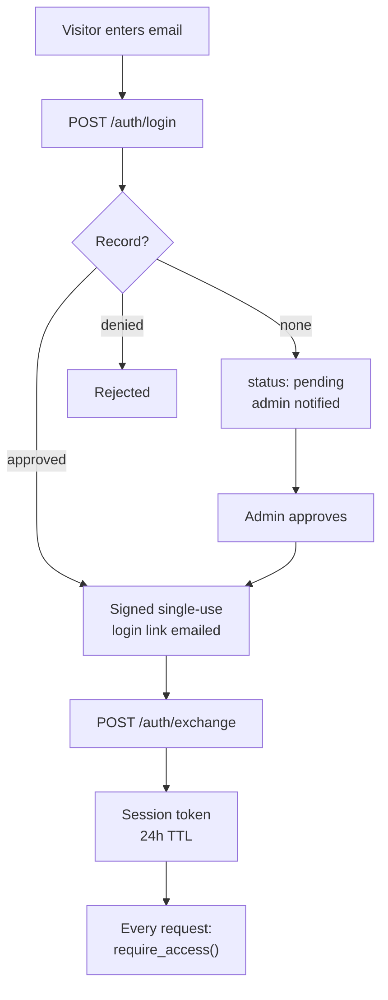

# Access control

The agent sits behind an email approval gate rather than being open to the
world. This documents what [`proxy/access.py`](../proxy/access.py) and
[`proxy/admin.py`](../proxy/admin.py) actually do, and what each environment
variable does when you leave it unset.

## Trust model

Access is bound to **control of an inbox**, not to a typed string. The email a
visitor types only ever *starts* a request — it never grants anything. Every
subsequent call carries an HMAC-signed token whose signature is checked on each
request, and `token_version` on the record revokes every live session for an
address at once when they are denied or deleted.

Purposes are baked into every signature, so a token minted for one job cannot be
replayed as another: a login link cannot become a session, and neither can stand
in for an admin one-click action.

## The flow

The session token rides on the existing `Authorization: Bearer` header, so
nothing about the CORS allow-list or the UI's header plumbing changed when this
replaced Firebase auth.

## Gate states

`check_access()` returns one of five codes, and the UI keys its modal off each.
`require_access()` is the same check raising a 403 — it runs at the top of
`/analyze-prompt`, **before anything costs money**.

| Code | Meaning |
|---|---|
| `ok` | Approved and under quota |
| `no_session` | No token, or no record for the address |
| `pending` | Request awaiting admin approval |
| `denied` | Explicitly refused |
| `limit_reached` | Approved, but `tokens_used >= token_limit` |

## Token lifetimes

| Token | TTL | Constant |
|---|---|---|
| Login link | 15 minutes | `LOGIN_LINK_TTL_S` |
| Session | **24 hours** | `SESSION_TTL_S` |
| Admin one-click action | 7 days | `ADMIN_ACT_TTL_S` |
| Admin session | 12 hours | `ADMIN_SESSION_TTL_S` |

> The module docstring at [`proxy/access.py:11`](../proxy/access.py#L11) says
> "30-day session". That is stale — the constant is 24 hours.

The 24-hour session is paired with the UI holding the token in `sessionStorage`:
closing the browser ends the session, and a browser left open all week still
expires. Neither bound is sufficient alone.

Login links are **single-use** — `consume_login_nonce()` invalidates the nonce on
exchange.

## Quota

Each record carries `tokens_used` and `token_limit`. Usage is recorded per turn
from the summed `causal_usage` channel — which is why the double reduction
described in [DEPLOYMENT.md §1.5](DEPLOYMENT.md) matters here too: under-counting
tokens lets the gate pass turns it should have stopped.

A user at their limit can request an extension (`POST /access/extension`), which
sets `extension_status` and notifies the admin. They stay blocked until it is
granted.

## Admin

`/admin` is a self-contained dashboard; all data arrives via JSON endpoints.
Auth is two-factor by construction: the `ADMIN_TOKEN` password, then a 6-digit
OTP emailed to `ACCESS_NOTIFY_EMAIL`.

Approve/deny/grant links in the admin's inbox work directly via `/admin/act`
without a dashboard session — that is what `ADMIN_ACT_TTL_S` covers.

`/admin/sweep` runs retention manually. It deletes expired conversations and, for
each, makes a best-effort delete of the **Agent Engine session** — Agent Engine
keeps conversation state server-side, so dropping only the Firestore copy would
leave the 24-hour promise half true.

## Storage

Firestore, in a **named** database (not `(default)`):

| Collection | Holds |
|---|---|
| `agent_access` | One record per address: status, quota, `token_version` |
| `agent_runs` | Per-turn metrics: ok/error, latency, tokens |
| `admin_otp` | Live admin OTP challenges |

Both hold the minimum the feature needs and nothing else — **no IP addresses, no
prompt text, no user agents** — because the privacy notice shown in the access
modal promises exactly that.

Records are cached in-process for 30 seconds (`_RECORD_CACHE_TTL_S`), since the
gate reads one on every single request.

## Environment variables

| Variable | Default | If unset |
|---|---|---|
| `ACCESS_SIGNING_SECRET` | ephemeral random | **Every cold start signs all users out.** Warns loudly rather than failing closed — failing closed would take the whole site down |
| `ADMIN_TOKEN` | — | `/admin` returns 503; nobody can approve anyone |
| `APP_URL` | `http://localhost:8080` | On a managed runtime the revision **refuses to start**. See below |
| `FIRESTORE_DATABASE_ID` | `tracerlensai` | Reads the pre-rename database. Set explicitly per stack |
| `ACCESS_NOTIFY_EMAIL` | `jacobbinu4488code@gmail.com` | Where approval requests and admin OTPs go |
| `ACCESS_FROM_EMAIL` | derived | Sender address |
| `RESEND_API_KEY` | — | No mail transport unless `SMTP_*` is set |
| `SMTP_HOST` / `_PORT` / `_USER` / `_PASSWORD` | — / 587 | Alternative transport to Resend |
| `ACCESS_TOKEN_LIMIT` | `200000` | Default per-user quota |
| `ACCESS_TOKEN_GRANT` | `200000` | Tokens added per granted extension |
| `CHAT_RETENTION_HOURS` | `24` | How long conversations survive |
| `RUN_METRICS_RETENTION_DAYS` | `30` | How long run metrics survive |
| `ACCESS_STORE` | — | `memory` swaps in a process-local dict. **Never in production** |
| `ALLOW_LOCALHOST_APP_URL` | — | Overrides the `APP_URL` refusal deliberately |

### Why `APP_URL` fails closed

The public origin comes from configuration only — **never** from the request's
`Host` header. Magic-link email is the textbook target for host-header
injection: an attacker sends a login request carrying `Host: evil.com`, the
victim receives a mail whose link points there, and clicking it hands the
single-use token to the attacker.

An empty value counts as unset, because `os.getenv(name, default)` returns the
empty string rather than the default when a variable is present but blank —
which a compose file or a CI secret that resolved to nothing produces easily.

On Cloud Run, refusing to start is the safer failure: mailing links that point at
the recipient's own machine would be delivered successfully, dead on arrival, and
silent.

## Local development

`ACCESS_STORE=memory` runs the gate without cloud credentials — the gate reads a
record on every request, so without it, offline mock mode would need Firestore
just to open the chat. `docker/local-entrypoint.sh` sets this automatically under
`MODE=mock`, along with `ADMIN_TOKEN=local-admin`. Emails are printed to the logs
rather than sent; approve yourself from the link that appears there.

## Self-service erasure

`DELETE /account` removes the access record and every conversation for the
caller. `POST /admin/user/delete` does the same from the admin side. Both bump
`token_version`, so live sessions die immediately rather than lingering until
their TTL.
